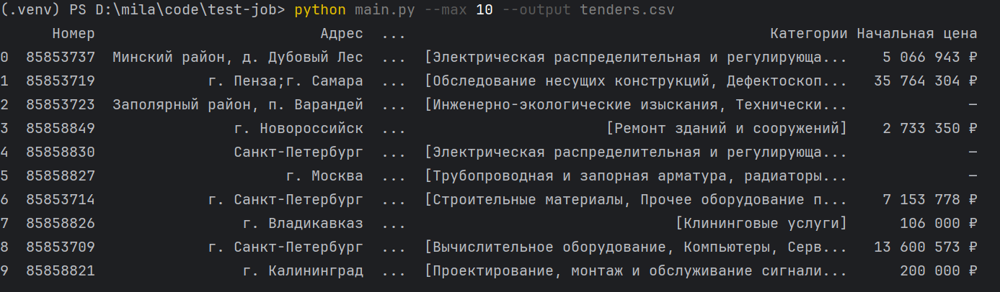

# tender-scraper

**`tender-scraper`** — мини-приложение на Python для загрузки и сохранения информации о тендерах с сайтов:
- [RosTender](https://rostender.info/extsearch)

## 📌 Возможности
- Загружает **первые --max тендеров** с одного из поддерживаемых источников.  
- Извлекает поля (Номер тендера, Ссылка на тендер, Начальная цена (при наличии), Сроки начала и окончания, Описание, Адрес, Регион, Категории)
- Сохраняет результат в **CSV**.
- Имеет CLI-интерфейс:  
  ```bash
  python main.py --max 10 --output tenders.csv 

## Стек технологий

* **Язык программирования:** Python 3.11
* **Загрузка HTML:** requests
* **CLI-интерфейс:** argparse
* **Парсинг страниц:** lxml
* **Хранение данных:** CSV

## Установка и запуск

### 1. Клонирование репозитория

```bash
git clone https://github.com/petmila/tender-scraper.git
cd tenders
```

### 2. Создание виртуального окружения

```bash
python -m venv venv
source venv/bin/activate  # для Linux / macOS
venv\Scripts\activate     # для Windows
```

### 3. Установка зависимостей
 
```bash
pip install -r requirements.txt
```

## Запуск

### 1. CLI-режим

Выполните команду:

```bash
python main.py --max 20 --output tenders.csv
```

Параметры опциональны:

* **--max** — количество тендеров для загрузки (по умолчанию 100)
* **--output** — путь к файлу CSV

Пример результата:

Список тендеров сохраняется в указанный файл и в консоль выводится превью


### 2. API-режим

Запуск сервера осуществляется командой:

```bash
uvicorn app:app --reload
```

Доступные маршруты:

* GET /tenders — возвращает JSON с загруженными тендерами

## Что можно улучшить

* Добавить многопоточную/асинхронную загрузку для ускорения
* Реализовать парсер для нескольких источников с выбором через CLI. Выделить общий интерфейс парсера и реализацию для каждого источника
* Добавить логирование и обработку ошибок (повторы при неудачных запросах)
* Сделать тесты (pytest)
